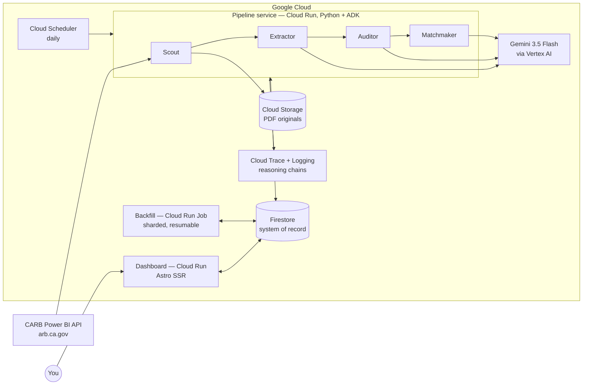

# CarbLegal

**CARB's database, inverted: every street-legal aftermarket part, searchable by your exact car — kept current by an autonomous agent, not a person.**

California certifies aftermarket parts through Executive Orders published only as PDFs, indexed by manufacturer. There has never been a way to search them by *vehicle*. CarbLegal is an autonomous multi-agent system that ingests those PDFs, extracts structured parts and vehicle-fitment data with Gemini, audits its own output, and answers the question every buyer actually asks: **"Is it CARB legal for my car — and which part number is the right one?"**

Built for the [All Things Agentic Hackathon](https://allthingsagentichackathon.devpost.com) (deadline Aug 31, 2026) — **Taskmaster track**: a background agent that handles a messy, multi-step, real-world chore end to end.

> **Status: pipeline built (branch `build/pipeline`) — cloud deployment in progress.** All four agents, the runner, seeds, ADK integration, and infra scripts are implemented with 57 passing tests and per-task independent review. Firestore is seeded (24,902 vehicles, 5,933 legacy baselines) and the 6,055-PDF corpus is staged in GCS. Spin-up instructions land with the deployed system.
>
> **Docs:** [design spec](docs/superpowers/specs/2026-08-26-carb-eo-agent-pipeline-design.md) · [decision log](MEMORY.md) · [plan/TODO](TODO.md) · [demo script](docs/demo-video-script.md) · [submission checklist](docs/submission-checklist.md) · [changelog](CHANGELOG.md)
>
> **Timeline:** feature-complete target Aug 28, then **two reserved rework days** (Aug 29–30), demo recorded Aug 30, submission Aug 31 by noon PDT.

---

## The Problem (a real one, with receipts)

CARB certifies aftermarket parts as street-legal via Executive Orders — published only as PDFs (6,055 of them, ~23,000 pages, formats spanning four decades: modern digital tables, pre-1990 typewriter layouts, image-only scans).

A production regex/OCR pipeline ([SmogLegal](https://smoglegal.pages.dev), the predecessor to this project) extracts this data today with `pdfplumber` + 67KB of hand-tuned table heuristics. Measured against its own SQLite output, the regex approach:

- Extracted **zero part numbers for 3,927 of 5,933 parts** (66%)
- **Discards the part-number ↔ vehicle association entirely** — the schema has no `part_number` on fitment rows, so an EO covering 716 part numbers (D-269-30) can say "something here fits your Silverado" but never *which part*
- Produces suspicious artifacts (parts have exactly 4, exactly 8, or 10+ part numbers — never 1–3)
- Yields nothing at all from image-based and corrupted PDFs
- Requires a fully manual, local, multi-hour re-run whenever CARB publishes new EOs

The chore this agent removes: a human (or a brittle script) watching a government website, reading legal PDFs, transcribing tables, cross-referencing vehicle databases, and updating a catalog — forever.

## The Solution

Four specialized agents on Google Cloud, triggered daily by Cloud Scheduler, with a human review queue for the cases the agents genuinely can't decide:

| Agent | Job | Uses Gemini? |
|---|---|---|
| **Scout** | Polls the CARB Power BI listing, diffs against the registry, downloads new EO PDFs, enqueues work | No — discovery is bookkeeping; an LLM here would be malpractice |
| **Extractor** | Reads each PDF natively (no OCR layer) → schema-constrained JSON: EO metadata, device family, category, supersession chain, and fitment rows *each carrying their own part numbers* | Yes — Gemini 3.5 Flash via Vertex AI, temperature 0, response schema enforced |
| **Auditor** | Validates extractions: deterministic checks first (free), legacy-output comparison second, skeptical Gemini critique pass third (selective). Verdicts: accept / fix once / escalate to human review | Yes — separate critique call, fresh context |
| **Matchmaker** | Joins fitment rows to 24,902 real vehicle trims (proven deterministic logic ported from the legacy pipeline); ambiguous rows go to Gemini with a required one-line rationale per decision | Only for the ambiguous minority |

Plus a **dashboard** (Astro SSR on Cloud Run — the hosted judging URL): pipeline health with live queue view and cost meter, per-EO reasoning traces, the human review queue, an EO browser with legacy-vs-agent diffs, and the consumer payoff — vehicle search returning categorized legal parts with exact per-vehicle part numbers.

## Architecture



Every service earns its place in one sentence:

| Service | Justification |
|---|---|
| Cloud Run (services ×2) | Pipeline and dashboard decoupled — one crashing can't take down the other; both scale to zero |
| Cloud Run Jobs | The 6,055-PDF backfill is a sharded batch workload, not a service |
| Cloud Scheduler | Daily trigger — what makes this a *background* agent, not a script someone runs |
| Cloud Storage | Immutable PDF originals; Gemini reads them by `gs://` URI |
| Firestore | Serverless system of record: registry, extractions, matches, work queue, review queue, run traces |
| Vertex AI | Gemini with service-account auth — **zero API keys anywhere** |
| Cloud Trace + Logging | Per-EO reasoning-chain observability |
| IAM | Least-privilege service account per component |
| Secret Manager | The one secret that exists (dashboard admin token) |
| Cloud Build / Artifact Registry | `gcloud run deploy --source` deployment path |

Deliberately **not** used, on the record: Pub/Sub (a Firestore queue is inspectable in the dashboard and sufficient at this scale), BigQuery (no analytical workload), GKE (nothing needs a cluster), Terraform (idempotent `gcloud` scripts are honest and readable at 5-day scope), and the Vertex Agent Engine / Memory Bank / Model Armor suite (our memory is Firestore; our guardrails are the Auditor).

## Data Model (Firestore)

| Collection | Contents |
|---|---|
| `eos/{eoNumber}` | Registry + pipeline state + accepted extraction summary. Part identity is merged in — CARB certifies one device *family* per EO (verified 1:1 across all 5,933 legacy parts), and Firestore rewards read-shaped data |
| `extractions/{eo}_v{n}` | Full versioned Gemini output incl. fitment rows with **per-row part numbers**, audit verdict, token/cost accounting, prompt+schema version stamp |
| `legacy_extractions/{eo}` | One-time import of the regex pipeline's output — powers before/after diffs and honest improvement stats |
| `vehicles/{id}` | 24,902 vehicle trims (year/make/model/trim/engine), seeded once from the legacy DB; loaded into worker memory at match time — never queried per-row |
| `matches/{eo}_{vehicleId}` | Confidence tier, method (deterministic \| gemini_resolved + rationale), **part numbers applicable to that specific vehicle**, and denormalized display fields so vehicle search is a single indexed query with zero joins |
| `work_items/{id}` | The queue: leased, idempotent, attempts-capped — watchable live in the dashboard |
| `review_queue/{id}` | Agent escalations with the agent's own explanation of its doubt; human actions feed back into the pipeline |
| `runs/{id}` (+`/events`) | One doc per pipeline run: counts, cost, per-EO reasoning timeline |

**Supersession, not revision:** CARB never silently edits a published EO — revisions arrive as *new* EO numbers that "supersede and cancel" predecessors (verified against arb.ca.gov documents). The Extractor captures `supersedes: [...]` from the PDF text and the pipeline marks predecessors accordingly — stale-certification awareness the legacy system never had.

## Design Principles

1. **Agents where reasoning lives, boring code where determinism wins.** Discovery, diffing, DB writes, and the proven matching logic are plain Python. Gemini does what regex demonstrably cannot: read four decades of inconsistent legal PDFs.
2. **Delta-driven.** Daily work is proportional to what CARB actually changed — near zero most days. The full corpus is touched only by the explicit, resumable backfill.
3. **Escalate, never guess.** Every uncertain decision becomes a visible review item instead of silent bad data — the legacy pipeline's failure mode, inverted.
4. **Idempotent by construction.** Deterministic doc IDs, leased work items, stateless workers: anything can crash and re-run; nothing duplicates; there are no destructive operations in the system.
5. **The agent pays its own bills.** Per-call token accounting rolls up to a per-run cost meter, with a hard per-run budget cap that halts gracefully.

## Cost Engineering (measured, not vibes)

Corpus measured from the actual 6,055 PDFs: avg 3.8 pages (median 3, p90 8, max 18) ≈ 23,000 pages. At Gemini 3.5 Flash rates ($1.50/M input, $9.00/M output; 258 tokens/PDF page):

| Backfill stage | Est. cost |
|---|---|
| Extraction — all 6,055 EOs | ~$23 input + ~$109 output |
| Audit critique — selective (~30% + 5% QA sample) | ~$19 |
| Ambiguous-match resolution + dev iterations | ~$25 |
| **Total (one-time backfill)** | **~$100–150** — within the hackathon's $150 GCP credit |

Levers, in order: selective critique (–65% on audit), cache-friendly prompt ordering (implicit caching discounts the repeated instruction prefix), compact omit-null output schema (output tokens dominate), and Vertex batch inference (–50%, decision gate after the measured sample run). Daily operation after launch rounds to cents; all infrastructure scales to zero.

Known unknowns, each with a scheduled measurement before we depend on it: new-project Vertex quota ceilings (day-1 console check), extraction quality on the hardest PDFs (day-1 spike on 10 gnarly ones), and average output tokens per EO — the number that swings total cost most (same spike).

## Security & Threat Model

- No API keys exist: Vertex AI uses Application Default Credentials; per-service least-privilege IAM (the dashboard's SA cannot invoke the pipeline; Scheduler's SA can invoke exactly one endpoint).
- The only secret (dashboard admin token, gating mutating actions) lives in Secret Manager.
- **Prompt injection via PDFs**, acknowledged: documents are untrusted model input. Exposure is bounded — sources are exclusively arb.ca.gov, output is schema-constrained JSON, extraction output is never interpreted as instructions, and the Auditor re-derives from source. Residual risk accepted and documented rather than papered over.
- The CARB downloader is rate-limited. Be polite to state agencies.

## Evaluation

A **golden set** of 25 hand-verified EOs (stratified: modern tables, pre-1990 text layouts, image-only scans, monster part-family EOs) serves as ground truth. A pytest eval harness scores extraction accuracy per field — regex baseline vs. agent — so every improvement claim in the demo is measured, not asserted.

## Planned Repository Layout

```
├── pipeline/            # Python — ADK agent service (Cloud Run)
│   ├── agents/          #   scout, extractor, auditor, matchmaker
│   ├── prompts/         #   versioned prompt templates + response schemas
│   ├── matching/        #   deterministic matching logic (ported, proven)
│   ├── core/            #   firestore repo, leased queue, gcs, cost meter
│   ├── seed/            #   one-time: vehicles + legacy extractions import
│   ├── main.py          #   FastAPI shell: scheduler endpoint, worker loop
│   ├── backfill.py      #   Cloud Run Job entrypoint (sharded, resumable)
│   └── tests/           #   pytest: matching, auditor rules, golden-set eval
├── dashboard/           # Astro SSR (Cloud Run)
├── golden/              # 25 verified expected-output JSONs + PDF fetch script
├── infra/               # setup.sh, deploy.sh, firestore.indexes.json
├── docs/                # architecture diagram (mermaid + exported PNG)
└── README.md
```

## Spin-Up Instructions

*Arrives with the code — will cover: GCP project setup via `infra/setup.sh` (APIs, Firestore, bucket, service accounts, IAM, Scheduler), deploy via `infra/deploy.sh`, seeding reference data, and running the pipeline + dashboard locally.*

## Provenance & Pre-Existing Artifacts (disclosure)

**Built in the hackathon window:** the entire agentic system — all four agents, prompts and extraction schemas, the Firestore data model, the audit/escalation/review machinery, the dashboard, and all deployment infrastructure.

**Pre-existing artifacts reused, with roles:**
1. The legacy regex pipeline's *output* (built before the window) is imported as `legacy_extractions` — it serves as the audit baseline/tripwire and the "before" in every before/after stat. Its code is not part of this system.
2. The deterministic vehicle-matching logic (~5KB, proven in production) is ported from the legacy pipeline into `pipeline/matching/`.
3. Vehicle reference data (24,902 trims, originally from FuelEconomy.gov/NHTSA) is seeded from the legacy database rather than re-crawled.

**Relationship to SmogLegal:** [SmogLegal](https://smoglegal.pages.dev) is the author's pre-existing regex-powered site built on this same data. CarbLegal — this hackathon entry — is the autonomous system that replaces its entire data pipeline on Google Cloud; SmogLegal's output serves as the measured "before" baseline throughout.

*CarbLegal is an independent project and is not affiliated with or endorsed by the California Air Resources Board.*

Design validated 2026-08-26 through a structured brainstorming process: every architectural assumption either grounded against the legacy system's real data (SQLite queries), against live sources (CARB documents, current Gemini pricing/limits), or explicitly listed above as a known unknown with a scheduled check. Full decision log with rejected alternatives: [MEMORY.md](MEMORY.md).
