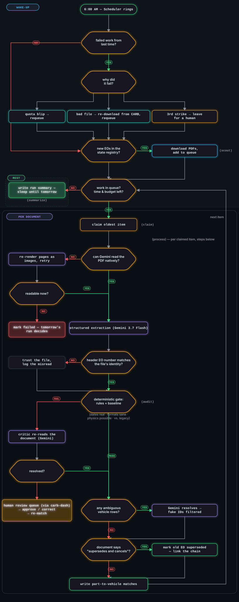

# CarbLegal

**CARB's database, inverted: every street-legal aftermarket part, searchable by your exact car — kept current by an autonomous agent workforce on Google Cloud.**

- **Dashboard (live):** https://carb-dash-cx5tppcuda-uc.a.run.app
- **Pipeline API:** https://carb-api-cx5tppcuda-uc.a.run.app (private; OIDC + admin token)
- Not affiliated with the California Air Resources Board. Data derived from public CARB Executive Orders.

## The problem

In California, modifying a car's emissions-related systems is illegal unless every part is covered by a CARB Executive Order (EO). Those approvals live in ~6,200 scanned PDFs spanning five decades of formats, scattered across a government website with no way to search by vehicle. Worse, the documents don't stay still: CARB revises by *replacement* — a new EO declares it "supersedes and cancels" an older one, while the old document stays published, unchanged. Any index that doesn't read the documents quietly rots. This system reads them.

## How it works

Daily runs execute a real [ADK 2](https://google.github.io/adk-docs/) graph workflow (`google.adk.workflow.Workflow`). The diagram below is **generated from the running code** (`py -3 tools/generate_diagram.py` introspects the Workflow object; a test asserts every node matches):



*Decision flow of every run — ADK 2 node names tagged; topology auto-generated in docs/architecture.mmd and verified by test. Live version: /architecture on the dashboard.*

**Four agents, one graph.** A **Scout** (function node) diffs CARB's live registry against known EOs — zero LLM calls on a quiet day. A **healer** node requeues yesterday's transiently-failed work (deterministic error classification; three strikes parks an item for a human), and a **refetch** node re-downloads source PDFs that arrived corrupt before retrying them. The **process** node runs the reasoning pipeline per EO: an **Extractor** reads the PDF with Gemini 3.7 Flash (native-PDF rung, image-render fallback rung, truncation detection via finish_reason); an **Auditor** critiques the extraction — and a **deterministic gate** (plain code, not AI) makes every final pass-or-escalate call using fixed rules: schema validation, EO-number format, required fields, a confidence threshold (0.75), and a row-count tripwire against the legacy baseline; a **Matchmaker** joins fitment rows to ~25,000 vehicles, with Gemini resolving only genuinely ambiguous applications (hallucinated IDs are filtered against the candidate set). Model output is never executed as instructions, only validated as data.

**State is the decision-maker.** What the registry diff finds decides what runs. Supersession links extracted from document text mark predecessors superseded (600+ real chains found). Human corrections in the review queue write new extraction versions and re-trigger matching — the pipeline resumes mid-stream.

**Built for dying.** Work items live in a leased Firestore queue: a killed instance's leases expire and the next run picks up exactly where it stopped. HTTP-invoked runs end gracefully at a time cap inside the scheduler's deadline. Every run is budget-capped (`BudgetGuard` stops the run the moment a call's metered cost crosses the cap) and every Gemini call's tokens and cost are metered into the run record. A scheduler drives the loop because an LLM can't be its own alarm clock.

**Why Firestore:** the access pattern is key-value by EO number plus a handful of indexed queries (vehicle → matches, status → work items), written by many workers under transactions (the lease claim is a CAS). Serverless, scales to zero with the rest of the stack, and the composite indexes are committed in `infra/firestore.indexes.json`.

## Google Cloud footprint

Cloud Run (2 services + jobs) · Cloud Scheduler · Firestore · Cloud Storage · Vertex AI (Gemini 3.7 Flash, online + batch inference) · Secret Manager · Cloud Build · Cloud Logging · IAM (3 least-privilege service accounts; zero API keys anywhere — ADC only; the single secret is the dashboard admin token).

## Run it yourself

Three tiers — pick by how much time you have.

### 1 · See it live (no setup)

Open the [dashboard](https://carb-dash-cx5tppcuda-uc.a.run.app). The overview's agent console replays the most recent run line by line; [/architecture](https://carb-dash-cx5tppcuda-uc.a.run.app/architecture) renders the decision flow (generated from the running code); on [/vehicles](https://carb-dash-cx5tppcuda-uc.a.run.app/vehicles) try **1990 → Ford → Mustang → 5.0L** and click any part's EO link through to CARB's own signed PDF.

### 2 · Verify the accuracy claims offline (~5 min, no Google account)

Prerequisite: Python 3.12+.

```bash
git clone https://github.com/bunger78/hackathon-carb-eo-pipeline
cd hackathon-carb-eo-pipeline/pipeline
pip install -r requirements.txt
python3 -m pytest -q        # Windows: py -3 -m pytest -q
```

**197 tests pass with zero credentials.** That includes the offline golden evaluation: the hand-verified answer key in `golden/expected/` is scored against committed agent and legacy-baseline extractions (`golden/actual/`), reproducing every accuracy number this README claims. (`pytest -m golden` re-runs the eval against live Vertex instead of fixtures — that needs tier 3 and spends tokens.)

### 3 · Deploy your own instance (~20 min + a GCP project)

Prerequisites: a GCP project with billing enabled, `gcloud` authenticated as its owner, and bash (**Cloud Shell works fine**). Both scripts are idempotent — safe to re-run.

```bash
bash infra/setup.sh  <PROJECT_ID>   # APIs, service accounts + IAM, Firestore (+ indexes, PITR), PDF bucket, admin-token secret (auto-generated)
bash infra/deploy.sh <PROJECT_ID>   # builds & deploys carb-api + carb-dash, wires the 6:00 AM scheduler
```

Then watch it work — no waiting for 6:00 AM:

```bash
gcloud secrets versions access latest --secret admin-token   # your instance's admin token
gcloud scheduler jobs run carb-daily --location us-central1  # trigger a run right now
```

Open the dashboard URL `deploy.sh` printed: the console shows the Scout discovering CARB's live registry and the pipeline reading its first documents end to end (discover → extract → audit → match). Pasting the admin token into the overview's **Run now** control does the same thing with one click.

**Cost expectations, honestly:** each document costs roughly 7¢ to read (Gemini 3.7 Flash list pricing, metered per run on the dashboard). A fresh project discovers the full ~6,200-EO registry; runs are time-capped and budget-capped, so each run processes a slice and the checkpointed queue resumes where it stopped. Watching the first few dozen documents flow through is enough to see every agent behave — completing the whole corpus costs a few hundred dollars (we ran ours at half price through `batchfill.py`, the Vertex batch-inference path).

**Optional seed data:** `seed/seed_vehicles.py` and `seed/seed_legacy.py` read from the author's pre-hackathon legacy SQLite corpus (not in this repo — see Provenance), so they aren't runnable by anyone else. Skipping them just means an empty `vehicles`/`legacy_extractions` registry: the pipeline still discovers, extracts, and matches from scratch — it only loses the legacy baseline that the audit tripwire and the accuracy comparison use.

The **evaluation** is the source of every accuracy claim: a hand-verified golden set (`golden/expected/`) scored against agent and legacy-baseline extractions (`golden/actual/` fixtures committed for offline reproduction; `pytest -m golden` re-runs live). Scoring is deliberately honest: association F1 counts missed rows as zeros, a row-coverage column separates extraction misses from key mismatches, and the legacy baseline gets its EO numbers credited from document IDs. We use deterministic checkers and golden comparison rather than LLM-as-judge — an LLM grading an LLM adds its own nondeterministic error. See `docs/golden-report.md`.

## Provenance (pre-existing artifacts, disclosed)

This project rebuilds the data pipeline behind the author's prior site (SmogLegal). Reused from before the hackathon window, as **data and baseline only**: the legacy regex pipeline's SQLite output (seeded to `legacy_extractions` — it is the *baseline the agent is measured against* and the audit tripwire's reference), the deterministic vehicle-matching normalization tables (ported and preserved in `pipeline/matching/`, not yet wired into the current exact-match engine), and the ~25k-vehicle reference table. **Every agentic component — the ADK2 graph, all four agents, the healer, the extraction ladder, the eval harness, the dashboard — was designed and built during the hackathon window.** AI coding assistants (Claude Code) were used throughout the build.

## Repo map

```
pipeline/            the agent system (Python 3.12)
  workflow_graph.py  ADK2 graph (scout → heal → refetch → claim → process → summarize)
  agents/            scout, extractor, auditor, matchmaker, healer, reviewer
  core/              Gemini gateway (+ cost metering), Firestore repo (leased queue), GCS
  matching/          deterministic vehicle-matching engine (ported legacy logic)
  tools/             golden_eval, generate_diagram, stage_holdback, batch/backfill ops
  tests/             197 tests, all runnable without credentials
  batchfill.py       half-price Vertex batch backfill (prepare/submit/ingest, resumable)
golden/              hand-verified answer key (expected/) + committed fixtures (actual/)
dashboard/           Astro SSR dashboard (carb-dash): live agent console, run traces,
                     EO browser w/ legacy diff + supersession lineage, review queue, vehicle search
infra/               idempotent setup/deploy scripts, committed Firestore indexes
docs/                architecture.mmd (generated), golden-report.md, design docs
ERRORS.md            debugging war stories kept honestly
```

## Findings & learnings

- **Prompt v2 experiment:** the dominant failure mode (incomplete extraction of long multi-page application tables) was found by trend-analyzing the review queue, fixed with explicit completeness directives, and measured: escalation rate dropped ~5× on subsequent runs. The flagged EOs were requeued and re-scored by the same tripwire that caught them.
- **The agent found work we didn't give it:** during a routine run, Scout discovered dozens of EOs CARB published after our corpus snapshot and processed them unprompted.
- **Live incidents that shaped the design:** a queue live-lock (shard pre-filtering fought the lease queue — deleted the filter, trusted the transactions), Vertex 429 storms at high concurrency (became the healer's reason to exist), and Cloud Scheduler's default 180s deadline killing long runs (became the graceful time cap). Details in `ERRORS.md`.
- **Deterministic beats clever:** every place we replaced an LLM judgment with a rule (the gate, the healer's error classifier, the row-count tripwire) got more testable and more trustworthy.

## Future work

Move the runner onto Agent Engine with Cloud Trace export, curate run events into BigQuery, and drive `adk optimize` from the golden eval to propose improved extraction instructions — the eval harness built here is the fitness function that loop needs. Extend the corrections queue into few-shot examples for the Extractor. Refresh vehicle reference data past model-year 2026.
